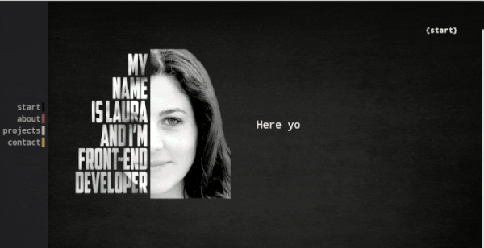

# My Personal portfolio:  laugeeme.com 

 
 ## Table of contents :clipboard:
* General info
* Technologies
* Setup

---------------------

## General info :microphone:
This project is my personal portfolio. Here you'll find the projects I've been working on.

----------------------
	
## Technologies :hammer:
Project is created with:
* React
* JavaScript
* HTML5 and CSS3
* Git, Sass and Gulp

----------------
	
## Setup :factory:
To run this project, install it locally using $ npm install.

--------------------

## About the author :woman_technologist:

I'm a front end developer based in Madrid, Spain.

Get in touch!:  hola@laugeeme.com 

------------

## Thanks!!

